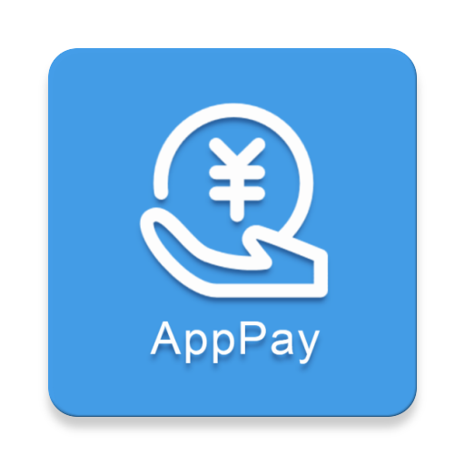
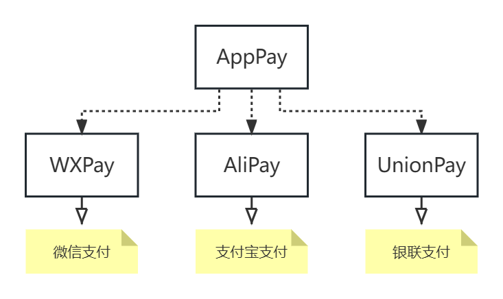

# AppPay



[](https://repo1.maven.org/maven2/com/github/jenly1314/AppPay)
[](https://jitpack.io/#jenly1314/AppPay)
[](https://circleci.com/gh/jenly1314/AppPay)
[](https://android-arsenal.com/api?level=16)
[](https://opensource.org/licenses/mit-license.php)
[](https://jenly1314.github.io/)
[](http://shang.qq.com/wpa/qunwpa?idkey=8fcc6a2f88552ea44b1411582c94fd124f7bb3ec227e2a400dbbfaad3dc2f5ad)

AppPay for Android 是一个专注于App支付的库，将主流的官方App支付集成方式进行二次封装，简化集成步骤，让实现App支付更简单。

**AppPay目前包括的库**

* WXPay：封装的微信支付库。
* AliPay：封装的支付宝支付库。
* UnionPay：封装的银联支付库。
* AppPay：基于以上所有子库进行整合再次封装，让集成App支付一步到位。

AppPay的整体结构：将多个独立封装的子库再次封装，并且使用更简单。

## 结构


## 引入

### Gradle:
```gradle
    // WXPay
    implementation 'com.github.jenly1314.AppPay:wxpay:2.0.0'

    // AliPay
    implementation 'com.github.jenly1314.AppPay:alipay:2.0.0'
    
    // UnionPay
    implementation 'com.github.jenly1314.AppPay:unionpay:2.0.0'
    
    // AppPay
    implementation 'com.github.jenly1314.AppPay:apppay:2.0.0'
```

## 使用

### WXPay

微信App支付：支持商户App调用微信提供的SDK调用微信支付模块，商户App会跳转到微信中完成支付，支付完后跳回到商户App内，最后展示支付结果；

**WXPay** 主要是基于官方的微信支付SDK进行二次封装，简化集成步骤；使用 **WXPay** 可快速接入微信App支付；

##### WXPay代码示例

```Java
    // 初始化微信支付
    mWXPay = new WXPay(Context context, String appId);

    // 发送微信支付请求
    mWXPay.sendReq(WXPayReq req);

```

> 使用微信支付时微信支付后的响应结果需要在 **WXEntryActivity** 类中去处理，这里只是提示，后面有具体的说明。

###  AliPay

支付宝App支付：指商家在商家移动端 App 中集成支付宝 SDK，调起支付宝来完成付款的一种支付产品。适用于在商家移动端 App 内使用支付宝支付功能的场景。

**AliPay** 主要是基于官方的支付宝支付SDK进行二次封装，简化集成步骤；使用 **AliPay** 可快速接入支付宝App支付；

##### AliPay代码示例
```Java
    // 初始化支付宝支付
    mAliPay = new AliPay(Activity activity);

    // 设置支付宝支付监听
    mAliPay.setOnPayListener(new AliPay.OnPayListener() {
        @Override
        public void onPayResult(boolean isSuccess, String resultInfo) {
            // 支付结果
            if(isSuccess){
                //TODO 支付成功
            }
        }
    });

    // 发送支付宝支付请求；
    mAliPay.sendReq(String orderInfo);

```

### UnionPay

银联支付：支持商户移动端APP或者WAP网页中拉起云闪付APP、手机Pay、银行APP（云网版、网银版）等支付工具完成支付；使用 **UnionPay** 可快速接入银联支付；

**UnionPay** 主要是基于官方的银联支付SDK进行二次封装，简化集成步骤；使用 **UnionPay** 可快速接入银联支付；

#### UnionPay代码示例

```java
    // 初始化银联支付
    mUnionPay = new UnionPay(Activity activity);
    
    // 设置银联支付监听
    mUnionPay.setOnPayListener(new UnionPay.OnPayListener() {
        @Override
        public void onPayResult(boolean isSuccess, String resultInfo) {
            // 支付结果
            if(isSuccess){
                //TODO 支付成功
            }
        }
    });
    
    // 发送银联支付请求；（参数：serverMode为银联后台环境标识；用于区分使用测试环境还是正式环境；说明参见：UnionPay.PRO_SERVER_MODE 和 UnionPay.TEST_SERVER_MODE）
    mUnionPay.sendReq(String orderInfo, String serverMode);
```
> 使用银联支付时需要在 `Activity` 中的 `onActivityResult` 方法中调用 **UnionPay** 的 **onActivityResult(int, int, Intent)}** 方法，这样设置的银联支付监听才会被触发。

#### AppPay

**AppPay** 是基于以上所有子库进行整合再次封装，让集成App支付一步到位。

#### AppPay代码示例
```Java

    // 初始化AppPay
    mAppPay = new AppPay(Activity activity);

    // 发送微信支付请求
    mAppPay.sendWXPayReq(WXPayReq req);
    
    // 设置支付宝支付监听
    mAppPay.setOnAliPayListener(new AliPay.OnPayListener() {
        @Override
        public void onPayResult(boolean isSuccess, String resultInfo) {
            // 支付结果
            if(isSuccess){
                //TODO 支付成功
            }
        }
    });
    
    // 发送支付宝支付请求
    mAppPay.sendAliPayReq(String orderInfo);
    

    // 设置银联支付监听
    mAppPay.setOnUnionPayListener(new UnionPay.OnPayListener() {
        @Override
        public void onPayResult(boolean isSuccess, String resultInfo) {
            // 支付结果
            if(isSuccess){
                // TODO 支付成功
            }
        }
    });

    // 发送银联支付请求（参数：serverMode为银联后台环境标识；用于区分使用测试环境还是正式环境；说明参见：UnionPay.PRO_SERVER_MODE 和 UnionPay.TEST_SERVER_MODE）
    mAppPay.sendUnionPayReq(String orderInfo, String serverMode);

```
> 使用微信支付时微信支付后的响应结果需要在 **WXEntryActivity** 类中去处理，这里只是提示，后面有具体的说明。

> 使用银联支付时需要在 `Activity` 中的 `onActivityResult` 方法中调用 **AppPay** 的 **onActivityResult(int, int, Intent)}** 方法，这样设置的银联支付监听才会被触发。

更多使用示例请查看[App](app)。

## 补充说明

### 关于微信支付结果回调

根据微信支付SDK要求，如果你的程序需要接收微信发送的请求，或者接收发送到微信请求的响应结果；需要下面 3 步操作：

1. 在你的包名相应目录下新建一个 **wxapi** 目录，并在该 **wxapi** 目录下新增一个 **WXEntryActivity** 类，该类继承自Activity；
并在 manifest 文件里面加上exported、taskAffinity及launchMode属性，其中exported设置为true，taskAffinity设置为你的包名，launchMode设置为singleTask，例如：
    ```xml
    <activity
        android:name=".wxapi.WXEntryActivity"
        android:label="@string/app_name"
        android:theme="@android:style/Theme.Translucent.NoTitleBar"
        android:exported="true"
        android:taskAffinity="填写你的包名"
        android:launchMode="singleTask">
    </activity>
    ```
2. ..
3. ..

> 这里我简化了步骤2和步骤3；你创建一个 **WXEntryActivity** 类之后，可以通过继承 **WXPayActivity**；然后实现`getAppId`和`onPayResult`方法就好。你也可以直接复制一份示例app中的[WXPayEntryActivity](app/src/main/java/com/king/pay/app/wxapi)类到你项目的 **wxapi** 目录。


这里贴出app中的[WXPayEntryActivity](app/src/main/java/com/king/pay/app/wxapi)示例：

```java
public class WXPayEntryActivity extends WXPayActivity {

    @Override
    public String getAppId() {
        // TODO 此处填写微信支付申请的AppID
        return "{your appId}";
    }

    /**
     * 支付结果，注意一定不能以客户端返回作为用户支付的结果，应以服务器端的接收的支付通知或查询API返回的结果为准
     *
     * @param code  0.成功
     *              -1.错误
     *              -2.用户取消
     * @param error 错误描述
     */
    @Override
    public void onPayResult(int code, String error) {
        // TODO 支付结果；此处可通过发送广播或者其他方式将支付结果发送出去

        // 示例：通过广播发送支付结果，然后在 MainActivity 中接收
        sendPayResultBroadcast(code, error);
    }
}
```
> 记得 **WXPayEntryActivity** 需要放在你项目包名的 **wxapi** 目录下，这一点很重要。

### 关于银联支付相关的应用可见性适配

当 **targetSdkVersion** 为30或以上时，请在 **AndroidManifest** 中加入以下内容，以符合 Android 应用可见性机制的要求。

方式一：直接配置读取所有应用列表的权限（可能会影响应用上架）

```java
<uses-permission android:name="android.permission.QUERY_ALL_PACKAGES" />

```

方式二：配置需要查询的应用对应的包名（如果你无法使用方式一，那么可以用方式二）

```xml
    <!-- 适配应用可见性：银联支付支持对应各商户相关的App包名 -->
    <queries>
        <!-- 云闪付 -->
        <package android:name="com.unionpay" />
        <!-- 其他安卓 pay -->
        <package android:name="com.unionpay.tsmservice" />
        <!-- 小米 pay -->
        <package android:name="com.unionpay.tsmservice.mi" />
        <!-- 华为钱包 -->
        <package android:name="com.huawei.wallet" />
        <!-- 平安口袋银行 -->
        <package android:name="com.cmbc.cc.mbank" />
        <!-- 中国建设银行 -->
        <package android:name="com.pingan.paces.ccms" />
        <!-- 建行生活 -->
        <package android:name="com.chinamworld.main" />
        <!-- 中信银行 -->
        <package android:name="com.ecitic.bank.mobile" />
        <!-- 动卡空间 -->
        <package android:name="com.citiccard.mobilebank" />
        <!-- 光大银行 -->
        <package android:name="com.cebbank.mobile.cemb" />
        <!-- 阳光惠生活 -->
        <package android:name="com.ebank.creditcard" />
        <!-- 民生银行 -->
        <package android:name="cn.com.cmbc.newmbank" />
        <!-- 全民生活 -->
        <package android:name="com.cmbc.cc.mbank" />
        <!-- 浦发银行 -->
        <package android:name="cn.com.spdb.mobilebank.per" />
        <!-- 浦大喜奔 -->
        <package android:name="com.spdbccc.app" />
        <!-- 交通银行 -->
        <package android:name="com.bankcomm.Bankcomm" />
        <!-- 买单吧 -->
        <package android:name="com.bankcomm.maidanba" />
        <!-- 招商银行 -->
        <package android:name="cmb.pb" />
        <!-- 掌上生活 -->
        <package android:name="com.cmbchina.ccd.pluto.cmbActivity" />
        <!-- 上海银行 -->
        <package android:name="cn.com.shbank.mper" />
        <!-- 上银美好生活 -->
        <package android:name="cn.com.shbank.pension" />
        <!-- 北京银行（京彩生活） -->
        <package android:name="com.bankofbeijing.mobilebanking" />
        <!-- 掌上京彩 -->
        <package android:name="com.csii.bj.ui" />
        <!-- 中国工商银行 -->
        <package android:name="com.icbc" />
        <!-- 工银 e 生活 -->
        <package android:name="com.icbc.elife" />
        <!-- 中国农业银行 -->
        <package android:name="com.android.bankabc" />
        <!-- 农银 e 管家 -->
        <package android:name="com.abchina.ebizbtob" />
        <!-- 邮储银行 -->
        <package android:name="com.yitong.mbank.psbc" />
        <!-- 邮储信用卡 -->
        <package android:name="com.yitong.mbank.psbc.creditcard" />
        <!-- 中国银行 -->
        <package android:name="com.chinamworld.bocmbci" />
        <!-- 缤纷生活 -->
        <package android:name="com.forms" />
        <!-- 广发银行 -->
        <package android:name="com.cgbchina.xpt" />
        <!-- 发现精彩 -->
        <package android:name="com.cs_credit_bank" />
        <!-- 兴业银行 -->
        <package android:name="com.cib.cibmb" />
        <!-- 好兴动 -->
        <package android:name="com.cib.xyk" />
        <!-- 华夏银行 -->
        <package android:name="com.hxb.mobile.client" />
        <!-- 华彩生活 -->
        <package android:name="com.HuaXiaBank.HuaCard" />
        <!-- 兰州银行 -->
        <package android:name="cn.com.lzb.mobilebank.per" />
    </queries>
```

## 其他

### ABI过滤

在Module的 **build.gradle** 里面的 android{} 中设置支持的 SO 库架构（可选，支持多个平台的 so，支持的平台越多，APK体积越大）

```gradle
    defaultConfig {
    
        //...
        
        ndk {
            //设置支持的 SO 库架构（开发者可以根据需要，选择一个或多个平台的 so）
            abiFilters 'armeabi-v7a' // , 'arm64-v8a', 'x86', 'x86_64'
        }
    }
```

### 官方文档

[微信支付Android接入指南](https://developers.weixin.qq.com/doc/oplatform/Mobile_App/Access_Guide/Android.html)

[支付宝支付Android接入指南](https://opendocs.alipay.com/open/204/105296)

[银联支付Android接入指南](doc/银联支付接入指南Android_v1.0.9.pdf)

## <a name="record">版本记录</a>

#### v2.0.0 ：2023-09-17
* 迁移发布至 MavenCentral
* 新增子库UnionPay（银联支付）
* 更新支付宝支付SDK依赖至v15.8.16（支付宝支付从AAR依赖更新为从Maven依赖）
* 更新微信支付SDK依赖至v6.8.24
* 更新Gradle至v7.3.3
* 更新compileSdk至32

#### v1.0.1 ：2019-11-14 （之前发布的版本是在JCenter）
* 移除support:appcompat-v7依赖
* 更新微信支付SDK依赖至v5.4.0
* 更新支付宝支付SDK依赖至v15.6.8（alipaySdk-15.6.8-20191021122514）

#### v1.0.0 ：2019-3-21
* AppPay初始版本
* AliPay 依赖AlipaySdk版本（alipaySdk-15.6.0-20190226104053）

## 赞赏
如果您喜欢AppPay，或感觉AppPay帮助到了您，可以点右上角“Star”支持一下，您的支持就是我的动力，谢谢 :smiley:<p>
您也可以扫描下面的二维码，请作者喝杯咖啡 :coffee:
<div>

</div>

## 关于我
Name: <a title="关于作者" href="https://jenly1314.github.io" target="_blank">Jenly</a>

Email: <a title="欢迎邮件与我交流" href="mailto:jenly1314@gmail.com" target="_blank">jenly1314#gmail.com</a> / <a title="给我发邮件" href="mailto:jenly1314@vip.qq.com" target="_blank">jenly1314#vip.qq.com</a>

CSDN: <a title="CSDN博客" href="http://blog.csdn.net/jenly121" target="_blank">jenly121</a>

CNBlogs: <a title="博客园" href="https://www.cnblogs.com/jenly" target="_blank">jenly</a>

GitHub: <a title="GitHub开源项目" href="https://github.com/jenly1314" target="_blank">jenly1314</a>

Gitee: <a title="Gitee开源项目" href="https://gitee.com/jenly1314" target="_blank">jenly1314</a>

加入QQ群: <a title="点击加入QQ群" href="http://shang.qq.com/wpa/qunwpa?idkey=8fcc6a2f88552ea44b1411582c94fd124f7bb3ec227e2a400dbbfaad3dc2f5ad" target="_blank">20867961</a>
   <div>
       
       
   </div>

